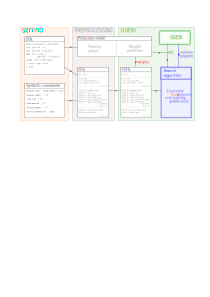

# Summary

Writing software is tedious, error-prone, and accessible only to a small share of the population -- yet coding grows increasingly important as the digital world plays larger and larger roles in peoples’ lives.
Programming by example seeks to make programming more reliable and accessible by allowing non-technical users to specify programs only from pairs of input-output examples.
`DeepSynth` is a general purpose programming by example tool, which combines predictions from neural networks with symbolic methods to generate programs. 
`DeepSynth` was used for the experiments of the recently published @Fijalkow:2021.

# Statement of need

`DeepSynth` is parameterised by a domain specific language (DSL), which is the programming language chosen for solving a program synthesis task. 
\autoref{fig:description} illustrates the machine learning pipeline on a toy DSL describing integer list manipulating programs. 
`DeepSynth` leverages PyTorch [@pytorch]: a neural network reads the examples and outputs predictions to guide the search towards likely programs.
`DeepSynth` includes a number of predictions-guided search algorithms; the most efficient is `HeapSearch`.
The search can be parallelised thanks to a new approach to partition the grammar and search through each part of the partition independently.

# How it works?

The user first specifies a DSL by giving a set of primitives together with their types and semantics, as well as semantic and syntactic constraints (such as program depth).
`DeepSynth` includes end to end procedures for training a neural network that makes predictions from examples. The predictions are given as distributions on the derivation rules of the context free grammar (CFG) representing the set of programs.

Once the DSL is specified and the prediction model trained, `DeepSynth` can be used as follows: the end user gives a few input-output examples, and `DeepSynth` searches for a program matching the examples.
An optional parallelisation framework allows the user to split the search on multiple CPUs by partitioning the progam space. 

The full technical details are described in @Fijalkow:2021.

# State of the field

Programming by example has been intensively investigated in the past years both in academia and in industry, in particular thanks to the success of FlashFill in Microsoft Excel, allowing nontechnical users to synthesize spreadsheet programs by giving examples.
The recent release of the GitHub Copilot [@copilot], powered by the Codex big language model from OpenAI, shows the wide applicability of the framework: Copilot is presented as `your AI pair programmer`, meaning that it assists developers by autocompleting
pieces of code in an interactive fashion.

# Features

The package allows to:

- create a DSL from syntaxic constraints and semantics functions;
- Transform this DSL into a Context Free Grammar (CFG);
- Transform this CFG into a Probabilistic CFG (PCFG);
- Sample programs from a PCFG;
- Enumerate programs in a PCFG with different algorithms including `HeapSearch`;
- A grammar splitter that enables to split the search into `n` independent searches, enabling parallel search scaling linearly with the number of CPUs;
- A neural network architecture to predict probabilities of a CFG given pairs of input-output examples and its automatic training procedure from a DSL that supports `int`, `bool` and `list` inputs.

# References
