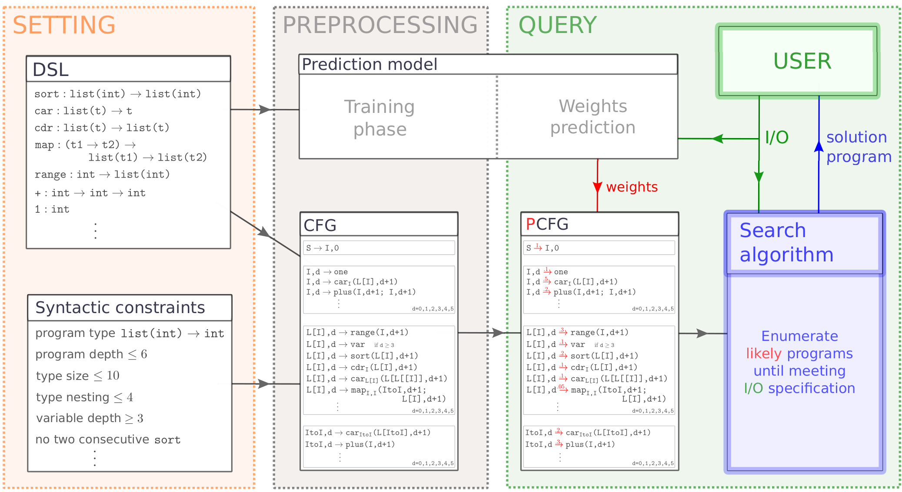

# Summary

Writing software is tedious, error-prone, and accessible only to a small share of the population -- yet coding grows increasingly important as the digital world plays larger and larger roles in peoples’ lives.
Programming by example seeks to make programming more reliable and accessible by allowing non-technical users to specify programs only from pairs of input-output examples.
`DeepSynth` is a general purpose programming by example tool, which combines predictions from neural networks with symbolic methods to generate programs. 

# Statement of need

`DeepSynth` was used for the experiments of the recently published @Fijalkow:2021.
The main purpose was to evaluate and compare different search algorithms and their integration with neural predictions.
Beyond the publication @Fijalkow:2021, the goal of `DeepSynth` is to serve as a reference implementation of existing neuro-symbolic methods for programming by example.
Indeed, it includes different options for different parts of the pipeline, focussing on neural predictions and search algorithms.

# How it works

`DeepSynth` is parameterised by a domain specific language (DSL), which is the programming language chosen for solving a program synthesis task. 
The user first specifies a DSL by giving a set of primitives together with their types and semantics, as well as semantic and syntactic constraints (such as program depth).
The compilation phase constructs a Context Free Grammar (CFG) representing the set of programs.

The second ingredient is the prediction model.
`DeepSynth` leverages PyTorch [@pytorch]: a neural network reads the examples and outputs predictions to guide the search towards likely programs.
`DeepSynth` includes end to end procedures for training a neural network that makes predictions from examples. The predictions are given as distributions on the derivation rules of CFG.

\autoref{fig:description} illustrates the machine learning pipeline on a toy DSL describing integer list manipulating programs. 

Once the DSL is specified and the prediction model trained, `DeepSynth` can be used as follows: the end user gives a few input-output examples, and `DeepSynth` searches for a program matching the examples.
`DeepSynth` includes a number of predictions-guided search algorithms; the most efficient is `HeapSearch`.
An optional parallelisation framework allows the user to split the search on multiple CPUs by partitioning the progam space. 

We refer to the `readme` for example uses of `DeepSynth`.
The full technical details are described in @Fijalkow:2021.

# State of the field

Programming by example has been intensively investigated in the past years both in academia and in industry, spearheaded by the success of FlashFill in Microsoft Excel (see @Gulwani:2011), allowing users to synthesize spreadsheet programs by giving examples.
FlashFill is now integrated into the larger and more ambitious project PROSE by Microsoft Research (see the [website](https://www.microsoft.com/en-us/research/group/prose/)).
PROSE is a general purpose program synthesis tool (see the [GitHub repository](https://github.com/microsoft/prose/)).
It is based on constraint programming: in addition to the DSL, the end-user needs to specify so-called witness functions, which are used for specifying a programming by example instance in a SAT or SMT solver.

Other tools have emerged recently exploiting the programming by example paradigm, for instance [SmartFill](https://ai.googleblog.com/2014/10/smart-autofill-harnessing-predictive.html) for Google Sheets, and the TF-Coder for [TensorFlow](https://blog.tensorflow.org/2020/08/introducing-tensorflow-coder-tool.html) (see @Shi:2020).
Unlike PROSE, they are tailored to address a single domain: for SmartFill spreadsheet programs, and for TF-Coder tensorflow programs.
A number of other prototype tools have been developed in the academic world: DeepCoder was the first leveraging deep learning techniques (see @Balog2017), PC-Coder (see @ZoharW18), and recently the general-purpose DreamCoder (see @EllisWNSMHCST21).

The recent release of the GitHub Copilot (see @copilot), powered by the Codex large language model from OpenAI, shows the wide applicability of the program synthesis: Copilot is presented as `your AI pair programmer`, meaning that it assists developers by autocompleting pieces of code in an interactive fashion. The key difference is that specifications in Copilot are given in natural language, which may or may not include examples.

# Features

This package has the following capabilities:

- Create a DSL from syntactic constraints and semantics functions;
- Transform this DSL into a Context Free Grammar (CFG);
- Transform this CFG into a Probabilistic CFG (PCFG);
- Sample programs from a PCFG;
- Enumerate programs in a PCFG with different algorithms including `HeapSearch`;
- A grammar splitter that enables to split the search into `n` independent searches, enabling parallel search scaling linearly with the number of CPUs;
- A neural network architecture to predict probabilities of a CFG given pairs of input-output examples and its automatic training procedure from a DSL that supports `int`, `bool` and `list` inputs.

# References
