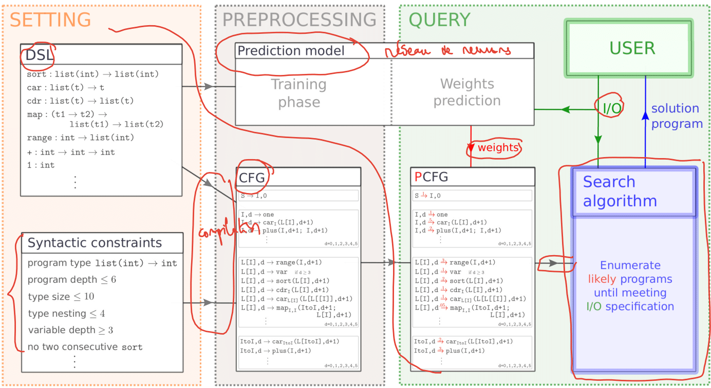

# Summary

Writing software is tedious, error-prone, and accessible only to a small share of the population – yet coding grows increasingly important as the digital world plays larger and larger roles in peoples’ lives.
One way to specify such programs is from pairs of input-output examples.
`DeepSynth` is such a framework. Contrary to other frameworks, `DeepSynth` leverages the speed of neural networks with the theoretical guarantees of symbolic methods to generate programs, combining the benefits of both worlds to make program synthesis scalable with guarantees.

# Statement of need

A common problem in program synthesis is to generate programs based on examples (PBE).  This automated synthesys shines when applied on domain specific languages (DSL). This DSL produced by the user can then be processed to generate programs however doing so is complex and the search for likely programs that fit the examples given can be hard.
`DeepSynth` proposes an automated pipeline for engineers , researchers and for students to generate programs based on pairs of input-output examples.
\autoref{fig:description} illustrates the machine learning pipeline for program synthesis on a toy DSL describing integer list manipulating program. This software is the implementation associated to the paper of [@Fijalkow:2021] (TODO: fix this to AAAI 2022 submission).
This framework leverages [@pytorch] to produce a neural network to guide the search based on examples towards likely programs.
The enumeration of likely programs can thus be done optimally.
It can furthermore be parallisled without concerns providing a scalable neural program synthesys approach.

# How it works?

A user can implement their own DSL. Then following the neural architecures already provided they can create a neural network that predict probabilities for their CFG.
We provide an automatic training procedure that supports a few common types off the shelf.
With their network now trained, they can directly use the trained network along with the provided algorithms to find their desired program.
Furthermore, they can scale with multiple CPUs by splitting the work on multiple CPUs with a small overhead at the start and a linear speedup in the number of CPUs. Technical details of our framework are described in our [Fijalkow:2021] paper.

# State of the field

There is mostly one application that enables users to generate programs based on a string description and that is GitHub Copilot [@copilot], which uses neural networks to predict what the user is going to type next. However this project is radically different from ours, first it has been trained on a lot of public code, and generates program without any guarantees based on a textual context whereas we work on the PBE scheme.
Furthermore, many DSL languages with which professionals wwork with may be limited to internal tools, where our framework can help whereas GitHub Copilot can't. Finally our software is free and open source whereas GitHub Copilot is indicated to be a paid service.

# Features

The package allows to:
- create a simple DSL from syntaxic constraints and semantics functions
- Transform this DSL into a context free grammar (CFG)
- Transform this CFG into a Probabilistic CFG (PCFG)
- Sample programs from a PCFG
- Enumerate programs in a PCFG with many different algorithms including `HeapSearch`, a method that is practically faster than $A^*$ while remaining optimal like the latter
- A grammar splitter that enables to split the search into `n` independent search, enabling easy parallel search without any concerns and scaling linearly with the number of CPUs.
- A neural network architecture to predict probabilities of a CFG given pairs of input-output examples and its automatic training procedure from a DSL that supports `int`, `bool` and `list` inputs.

# References